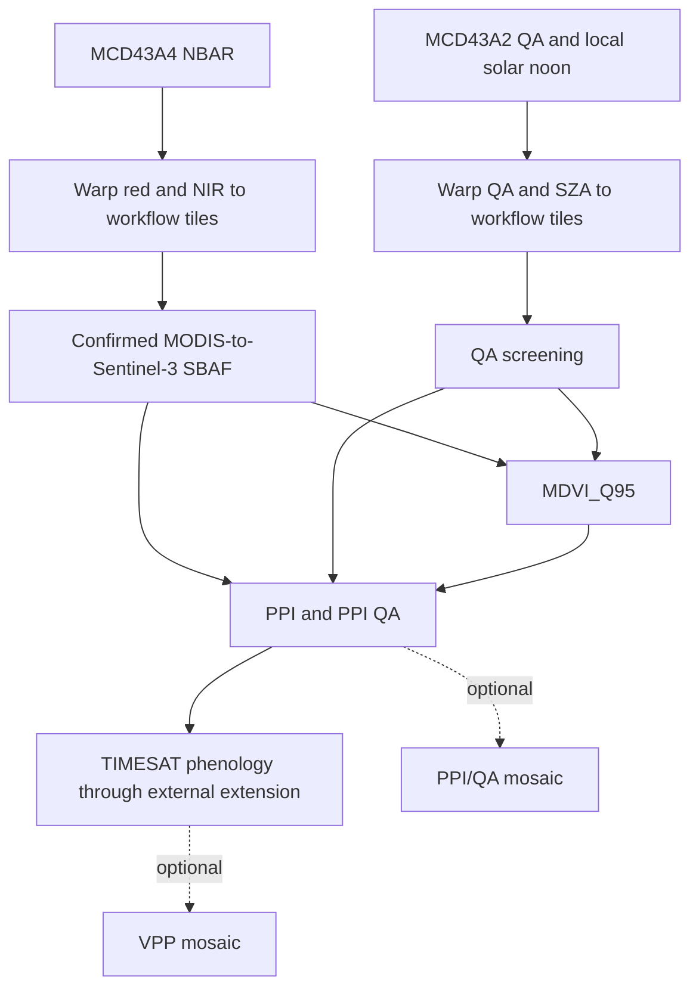

# Workflow

The acquisition scripts enumerate nominal days 1, 6, 11, 16, 21, and 26 of
each month, download intersecting MODIS tiles, warp them with nearest-neighbour
resampling, and merge them into the target tile. Missing dates are checkpointed.

The SBAF step uses unchanged multiplicative, NDVI-dependent quadratic factors:
red coefficients `(1.063247, 0.255060, -0.471804)` and NIR coefficients
`(1.044383, 0.007799, 0.0)`. These values were confirmed by the repository owner
as the operational MR-VPP 6.0 coefficients.

MDVI_Q95 uses dates with complete red, NIR, red-QA, and NIR-QA files. PPI also
requires local solar noon. `timesat41_mp.py` discovers matching PPI and QA files
over the configured daily date range and calls the external Fortran/F2PY core.

`merge_ppi.sh` and `merge_vpp.sh` are separate optional publication-stage tools.
They are not executed by the main launcher.
